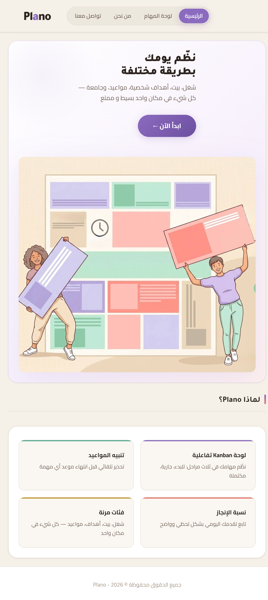
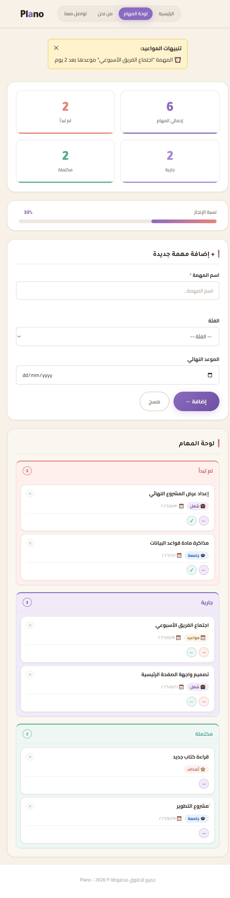
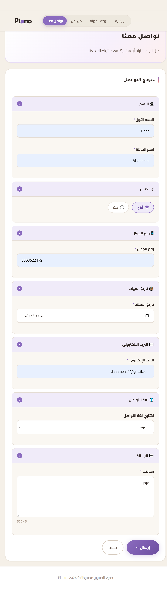
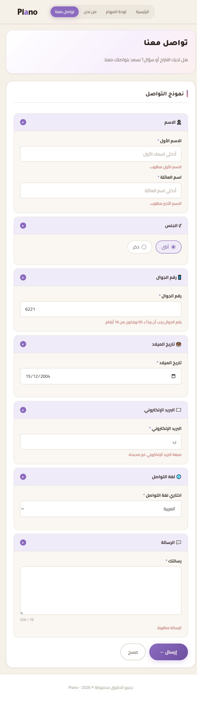

# Plano — Smart Task Management Web App

> A bilingual-ready (Arabic-first, RTL) task management web application with an interactive Kanban board, real-time progress tracking, and deadline alerts.

<p align="center">
  
</p>

<p align="center">
  <a href="#-getting-started">Getting Started</a> ·
  <a href="#-api-endpoints">API Docs</a> ·
  <a href="#-screenshots">Screenshots</a>
</p>

---

## 📋 Overview

**Plano** is a full-stack web application built to help users organize their daily tasks in a clean, intuitive Kanban-style interface. The app supports multiple life categories (work, home, goals, appointments, university, other), gives instant visual feedback on completion progress, and alerts users about upcoming or overdue deadlines.

The project demonstrates end-to-end web development skills: semantic HTML, responsive CSS, vanilla JavaScript on the frontend, and a Node.js/Express REST API backed by MySQL on the server side — with proper input validation and XSS sanitization on **both** layers.

---

## ✨ Features

- **🗂️ Interactive Kanban Board** — Three columns (To Do, Doing, Done) with one-click status transitions
- **📊 Live Progress Bar** — Real-time completion percentage updates as tasks change state
- **⏰ Deadline Alerts** — Automatic notifications for tasks that are due today, tomorrow, or overdue
- **🏷️ Task Categories** — Color-coded badges for Work, Home, Goals, Appointments, University, and Other
- **📝 Contact Form** — Fully validated contact form with multi-language support (Arabic, English, French)
- **🛡️ Dual-Layer Validation** — Client-side validation for UX + server-side validation for security
- **🧹 XSS Protection** — All user input is sanitized before being stored in the database
- **📱 Responsive Design** — Works on desktop, tablet, and mobile screens
- **🌐 RTL Support** — Native right-to-left layout for Arabic content
- **♿ Accessibility** — Semantic HTML, ARIA labels, and keyboard-friendly navigation

---

## 📸 Screenshots

### 🏠 Landing Page

A clean, RTL-aware landing page introducing the app and its features.

<p align="center">
  
</p>

### 🗂️ Kanban Dashboard

The main workspace — three columns showing task progress, with a live completion percentage bar and category-colored task cards.

<p align="center">
  
</p>

### 📝 Contact Form

A fully validated contact form supporting multiple languages.

<p align="center">
  
</p>

### 🛡️ Form Validation in Action

Real-time validation feedback — required fields, format checks (email, Saudi mobile, names), and clear error messages guide the user.

<p align="center">
  
</p>

---

## 🛠️ Tech Stack

### Frontend
- **HTML5** — Semantic markup with ARIA attributes
- **CSS3** — Custom properties (CSS variables), Flexbox, Grid, responsive design
- **Vanilla JavaScript (ES6+)** — No frameworks, pure DOM manipulation and Fetch API

### Backend
- **Node.js** — JavaScript runtime
- **Express.js 5** — Web framework and routing
- **MySQL2** — Database driver with prepared statements (SQL injection safe)

### Database
- **MySQL** — Relational database for tasks and contact messages

---

## 📁 Project Structure

```
Plano/
├── backend/
│   ├── server.js              # Express server + REST API endpoints
│   ├── package.json           # Backend dependencies
│   └── package-lock.json
├── css/
│   ├── style.css              # Main stylesheet (design system + components)
│   └── responsive.css         # Media queries for tablet/mobile
├── html/
│   ├── index.html             # Landing page (hero + features)
│   ├── dashboard.html         # Kanban board + task form
│   ├── about-us.html          # About the project
│   └── contact-us.html        # Contact form
├── js/
│   ├── main.js                # Shared UI logic
│   ├── kanban.js              # Kanban board logic (load, add, move, delete)
│   ├── validation.js          # Client-side form validation
│   ├── deadline-alert.js      # Deadline checking and alerts
│   └── contact.js             # Contact form submission
├── media/                     # Images and assets
├── screenshots/               # Project screenshots
├── .gitignore
└── README.md
```

---

## 🚀 Getting Started

### Prerequisites

Before running the project, make sure you have:

- **[Node.js](https://nodejs.org/)** (v16 or newer)
- **[MySQL](https://www.mysql.com/)** (v8 or newer) running locally — or **XAMPP** / **WAMP** which include MySQL
- **npm** (comes with Node.js)

### Installation

**1. Clone the repository**

```bash
git clone https://github.com/da6h/Plano.git
cd Plano
```

**2. Install backend dependencies**

```bash
cd backend
npm install
```

**3. Set up the database**

Open MySQL (or phpMyAdmin if using XAMPP) and run the following SQL:

```sql
CREATE DATABASE plano_db CHARACTER SET utf8mb4 COLLATE utf8mb4_unicode_ci;

USE plano_db;

CREATE TABLE tasks (
    id INT AUTO_INCREMENT PRIMARY KEY,
    task_name VARCHAR(80) NOT NULL,
    task_category VARCHAR(20),
    task_deadline DATE,
    task_status ENUM('todo', 'doing', 'done') DEFAULT 'todo',
    created_at TIMESTAMP DEFAULT CURRENT_TIMESTAMP
);

CREATE TABLE contacts (
    id INT AUTO_INCREMENT PRIMARY KEY,
    first_name VARCHAR(50) NOT NULL,
    last_name VARCHAR(50) NOT NULL,
    gender ENUM('male', 'female') NOT NULL,
    mobile VARCHAR(15) NOT NULL,
    dob DATE NOT NULL,
    email VARCHAR(100) NOT NULL,
    language ENUM('arabic', 'english', 'french') NOT NULL,
    message TEXT NOT NULL,
    created_at TIMESTAMP DEFAULT CURRENT_TIMESTAMP
);
```

**4. Configure database credentials**

Open `backend/server.js` and adjust the connection settings to match your local MySQL setup (host, user, password, and database name).

**5. Run the server**

```bash
node server.js
```

You should see:
```
✅ تم الاتصال بقاعدة البيانات بنجاح.
🚀 السيرفر يعمل على: http://localhost:3000
```

**6. Open the app**

Visit [http://localhost:3000](http://localhost:3000) in your browser.

---

## 🔌 API Endpoints

The backend exposes a small REST API:

### Tasks

| Method | Endpoint                  | Description                          |
|--------|---------------------------|--------------------------------------|
| GET    | `/api/tasks`              | Fetch all tasks (ordered by date)    |
| POST   | `/api/tasks`              | Create a new task                    |
| PUT    | `/api/tasks/:id/status`   | Update a task's status               |
| DELETE | `/api/tasks/:id`          | Delete a task                        |

### Contact

| Method | Endpoint        | Description                  |
|--------|-----------------|------------------------------|
| POST   | `/api/contact`  | Submit a contact message     |
| GET    | `/api/contact`  | Fetch all messages (admin)   |

### Example Request

```bash
curl -X POST http://localhost:3000/api/tasks \
  -H "Content-Type: application/json" \
  -d '{
    "task_name": "Finish project README",
    "task_category": "work",
    "task_deadline": "2026-05-25",
    "task_status": "todo"
  }'
```

---

## 🔐 Security Highlights

This project takes security seriously, even at a small scale:

- **Parameterized SQL queries** — All database queries use prepared statements (`?` placeholders) to prevent SQL injection.
- **Input sanitization** — A `sanitize()` helper escapes HTML special characters (`<`, `>`, `"`, `'`, `&`) before any user input touches the database.
- **Server-side validation** — Every endpoint validates request data independently of the frontend, so the API cannot be bypassed by disabling JavaScript.
- **Strict allow-lists** — Categories, statuses, genders, and languages are validated against fixed allow-lists.
- **Format validation** — Email format, Saudi mobile numbers (`05XXXXXXXX`), and ISO date formats are all regex-checked.

---

## 🎨 Design System

The CSS uses **CSS custom properties** (variables) for a consistent, themeable design:

- Centralized color palette with semantic naming (`--accent`, `--pink`, `--text-dark`, etc.)
- Reusable spacing and radius tokens (`--radius-md`, `--radius-xl`)
- Consistent shadows and transitions
- Category-specific badge colors

This makes the design easy to maintain and extend.

---

## 🧪 What I Learned

Building Plano gave me hands-on experience with:

- Designing and consuming a RESTful API
- Implementing dual-layer validation (client + server)
- Writing secure SQL with prepared statements
- Building responsive, RTL-aware layouts from scratch
- Managing state in vanilla JavaScript without a framework
- Structuring a small full-stack project cleanly
- Collaborating with a team using Git and GitHub

---

## 🛣️ Future Improvements

Things I'd like to add next:

- [ ] User authentication (so multiple users can have their own boards)
- [ ] Drag-and-drop between Kanban columns
- [ ] Task editing (not just delete + recreate)
- [ ] Filtering and search by category or status
- [ ] Dark mode toggle
- [ ] Deployment to a cloud platform
- [ ] Unit and integration tests

---

## 👥 Team

This project was built collaboratively by:

- **Danh** 
- **Banan Fadhel** 
- **Aroub Fattani**

---

## 📄 License

This project is available for educational and portfolio purposes.

---

*If you have feedback or suggestions, feel free to open an issue or reach out!*
